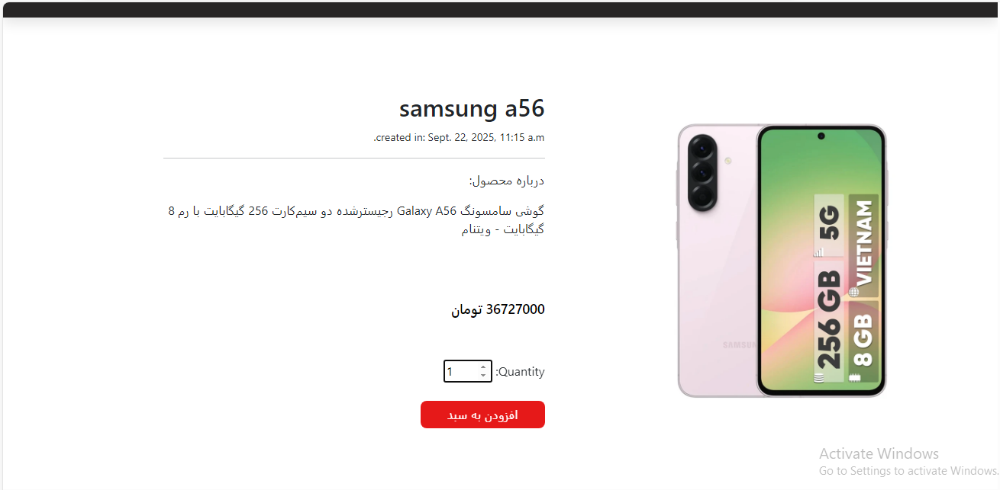
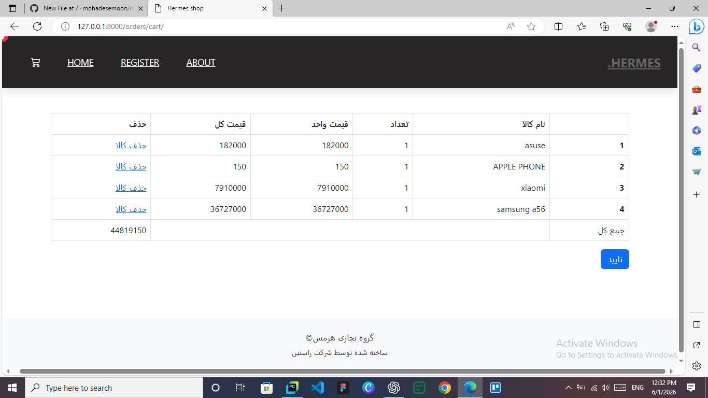
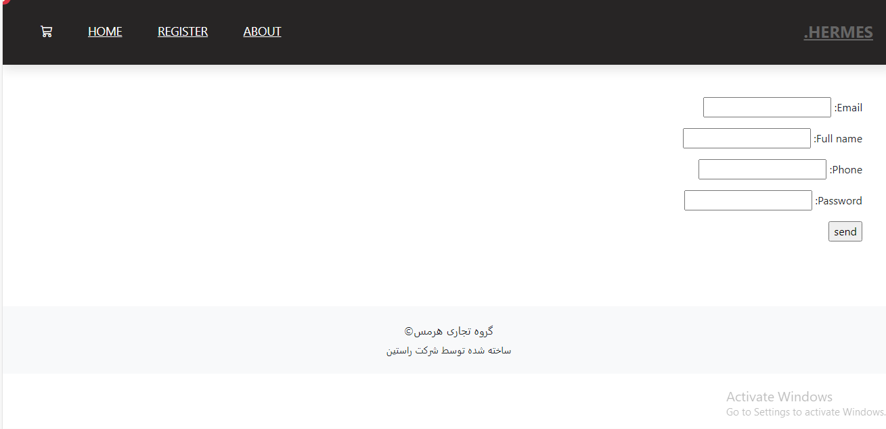
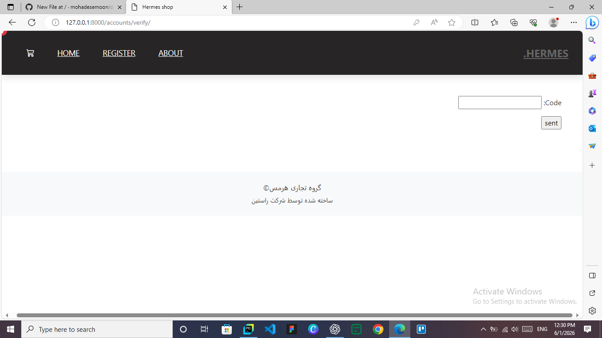

# Django E-Commerce Platform

A feature-rich e-commerce web application built with Django.

This project provides a complete online shopping experience including user authentication, shopping cart, order management, discount codes, product categorization, and administrative controls.

Designed with scalability, maintainability, and clean architecture principles in mind.

---

## Features

### Authentication & User Management

* User Registration
* Login / Logout
* Secure Authentication System

### Product Management

* Product Creation & Management (Admin)
* Product Categories
* Product Image Upload
* Product Detail Pages
* Product Listing

### Shopping Experience

* Shopping Cart
* Order Creation
* Order Management
* Discount Code System
* Product Browsing

### Administration

* User Management
* Product Management
* Category Management
* Order Monitoring

---

## Tech Stack

* **Backend:** Django
* **Frontend:** Django Templates
* **Database:** SQLite
* **Authentication:** Django Authentication System
* **Media Handling:** Django Media Files

---

## Project Structure

```txt
project/
├── accounts/
├── home/           #categories , products
├── orders          #cart
├── templates/
├── media/
└── manage.py
```

---
## Installation

Clone the repository

```bash
git clone https://github.com/your-username/project-name.git
cd project-name
```

Create virtual environment

```bash
python -m venv venv
```

Activate virtual environment

### Windows

```bash
venv\Scripts\activate
```

### Linux / macOS

```bash
source venv/bin/activate
```

Install dependencies

```bash
pip install -r requirements.txt
```

Apply migrations

```bash
python manage.py migrate
```

Create superuser

```bash
python manage.py createsuperuser
```

Run the server

```bash
python manage.py runserver
```

Open in browser

```txt
http://127.0.0.1:8000/
```

---

## Screenshots

Add screenshots of:

* Home Page
* 
* 
* Product Detail Page
* 
* Shopping Cart
* 
* User Register
* 
* 
* Admin Panel

---

## Future Improvements

* Payment Gateway Integration
* Product Reviews & Ratings
* Wishlist
* Search & Filtering
* REST API Version
* Docker Support

---

## License

This project is developed for educational and portfolio purposes.
